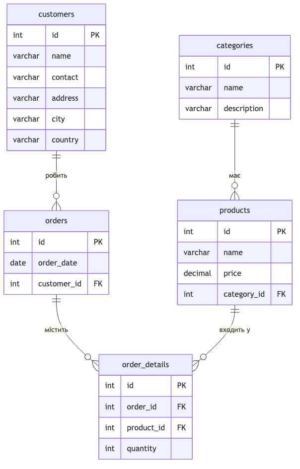

# goit-rdb-hw-02

Домашнє завдання до Теми 2 — **Проєктування баз даних з використанням семантичних
моделей**: нормалізація таблиці (1НФ → 2НФ → 3НФ), ER-діаграма та створення таблиць у
базі даних MySQL.

## Структура репозиторію

```
goit-rdb-hw-02/
├── README.md
├── docs/
│   └── normalization.md      # Етапи 1–3: нормалізація до 1НФ, 2НФ, 3НФ (з таблицями)
├── diagrams/
│   ├── er_diagram.mmd        # Етап 4: ER-діаграма (вихідний код Mermaid)
│   └── er_diagram.png        # Етап 4: ER-діаграма (зображення)
├── sql/
│   ├── create_tables.sql     # Етап 5: створення схеми mydb (таблиці + зв'язки)
│   └── seed_data.sql         # (опціонально) тестові дані з початкової таблиці
└── screenshots/              # сюди додати скриншоти p1_…p5_ (див. нижче)
```

## Початкова таблиця

| Номер_замовлення | Назва_товару і кількість | Адреса_клієнта | Дата_замовлення | Клієнт    |
|:----------------:|--------------------------|----------------|:---------------:|-----------|
| 101              | Лептоп: 3, Мишка: 2     | Хрещатик 1     | 2023-03-15      | Мельник   |
| 102              | Принтер: 1               | Басейна 2      | 2023-03-16      | Шевченко  |
| 103              | Мишка: 4                 | Комп'ютерна 3  | 2023-03-17      | Коваленко |

## Етапи 1–3. Нормалізація

Повний розбір із таблицями на кожному кроці — у [`docs/normalization.md`](docs/normalization.md).

Коротко:
1. **1НФ** — розкладаємо неатомарний стовпець «Назва_товару і кількість»: кожен товар —
   окремий рядок, назва й кількість — окремі стовпці.
2. **2НФ** — усуваємо часткові залежності від складеного ключа: атрибути замовлення
   (дата, клієнт, адреса) виносимо в `orders`, а зв'язок товар↔замовлення — в
   `order_details`.
3. **3НФ** — усуваємо транзитивні залежності: клієнта з адресою виносимо в `customers`,
   а категорію товару — в `categories`.

## Етап 4. ER-діаграма



Зв'язки:
- `categories 1 — ∞ products` — одна категорія має багато товарів;
- `customers 1 — ∞ orders` — один клієнт робить багато замовлень;
- `orders 1 — ∞ order_details` та `products 1 — ∞ order_details` — таблиця
  `order_details` реалізує зв'язок **багато-до-багатьох** між замовленнями й товарами.

## Етап 5. Створення таблиць

Схема (5 таблиць, 4 зовнішні ключі) описана у [`sql/create_tables.sql`](sql/create_tables.sql).
DDL перевірено на реальному **MySQL 8.4** — усі таблиці та зовнішні ключі створюються
без помилок.

| Таблиця         | Первинний ключ | Зовнішні ключі                              |
|-----------------|:--------------:|---------------------------------------------|
| `categories`    | `id`           | —                                           |
| `customers`     | `id`           | —                                           |
| `products`      | `id`           | `category_id → categories.id`               |
| `orders`        | `id`           | `customer_id → customers.id`                |
| `order_details` | `id`           | `order_id → orders.id`, `product_id → products.id` |

### Як розгорнути у MySQL Workbench

1. Відкрийте MySQL Workbench → підключіться до локального сервера (`Local instance 3306`).
2. **File → Open SQL Script…** → оберіть `sql/create_tables.sql` → виконайте (⚡).
3. У панелі **SCHEMAS** натисніть 🔄 (Refresh) — з'явиться схема `mydb` з таблицями.
4. *(Опціонально)* виконайте `sql/seed_data.sql`, щоб наповнити таблиці тестовими даними.

## Які скриншоти додати в `screenshots/`

Згідно з вимогою нумерувати файли за етапами (`p1_`, `p2_`, …):

| Файл           | Що на скриншоті                                                        |
|----------------|-----------------------------------------------------------------------|
| `p1_1nf.png`   | таблиця у 1НФ (з `docs/normalization.md`)                             |
| `p2_2nf.png`   | таблиці у 2НФ                                                          |
| `p3_3nf.png`   | таблиці у 3НФ                                                          |
| `p4_er.png`    | ER-діаграма (можна взяти `diagrams/er_diagram.png`)                    |
| `p5_schema.png`| **розгорнута схема `mydb` у Workbench** (дерево SCHEMAS з усіма таблицями та колонками) |

> `p5_schema.png` можна зробити лише вручну у своєму Workbench після виконання
> `create_tables.sql` — розгорніть у панелі SCHEMAS `mydb → Tables` з усіма колонками
> і зробіть знімок екрана.
